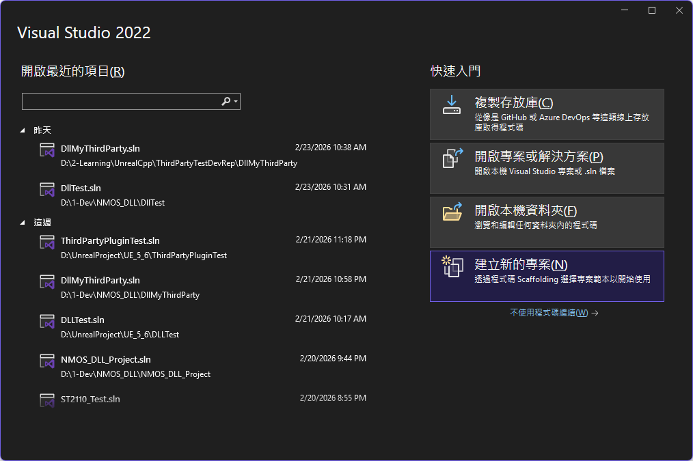
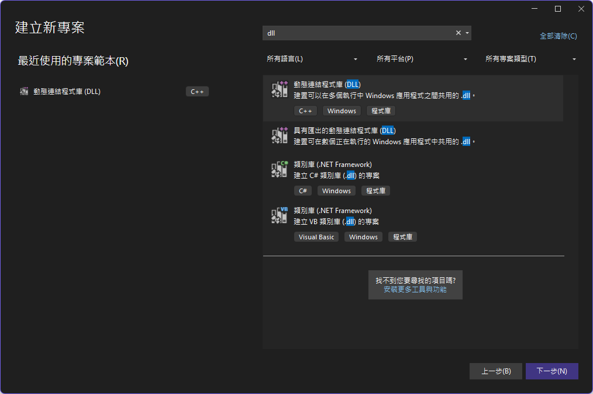
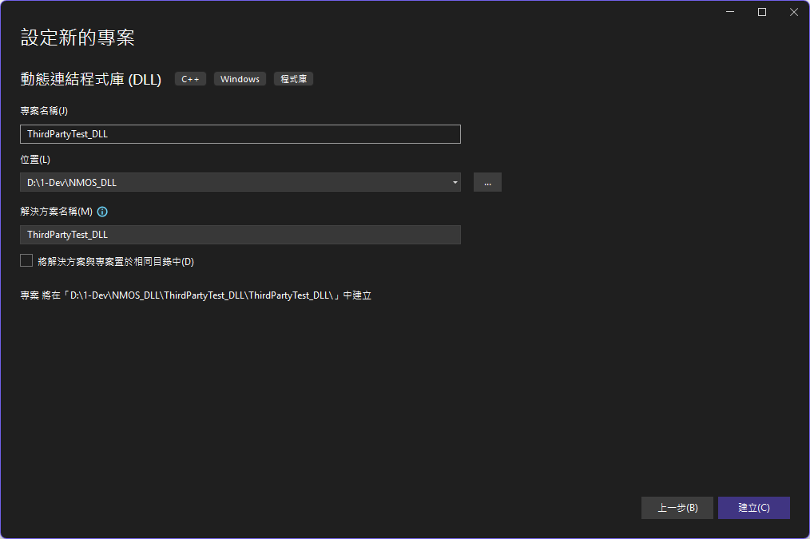
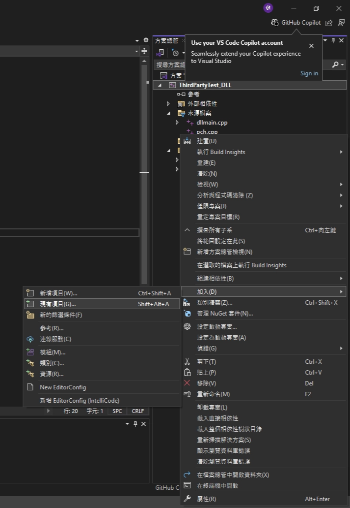
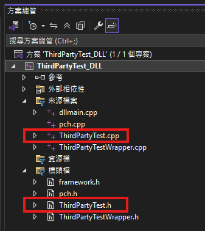
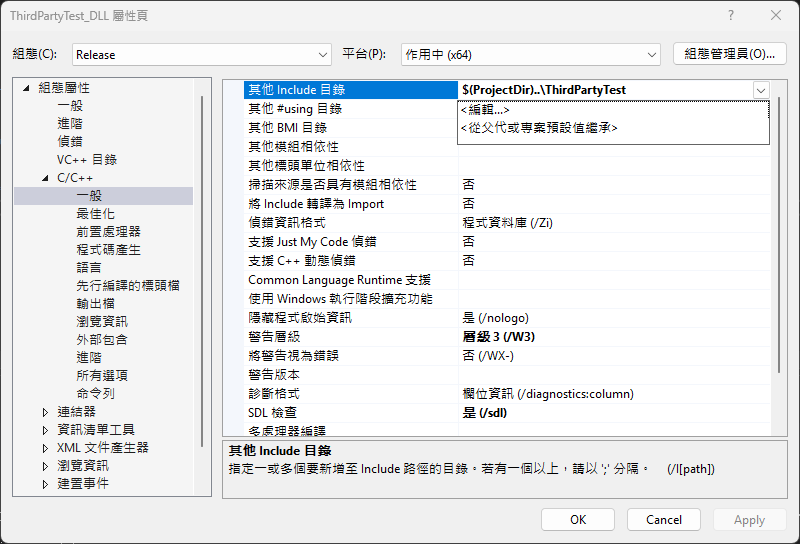

# 【Unreal & DLL 實戰系列】第四篇 —— Wrapper DLL

接下來，我們要建立一個專門負責**封裝第三方程式碼的 Wrapper DLL 專案**。這個 Wrapper 層的目的，是將原本以 C++ 類別實作的第三方邏輯，轉換成 Unreal Engine 能夠安全呼叫的 C API。透過這個 DLL，我們可以**完全隔離 Unreal 與第三方函式庫的編譯環境**，避免巨集衝突、ABI 不相容、記憶體配置器不一致等常見問題。完成編譯後，Visual Studio 會在 `x64/Release` 資料夾中產生 `.dll` 與 `.lib` 檔案：DLL 負責在執行時提供實際功能，而 LIB 則在 Unreal Plugin 編譯時提供符號資訊，兩者缺一不可。接下來我們將逐步設定 Wrapper 專案，讓它能順利匯出 C API 並與 Unreal 整合。

{/* truncate */}

### 建立  **Wrapper DLL 專案**

1. **開啟 Visual Studio**
    
    啟動 Visual Studio 後，在首頁右側選擇：
    
    **「建立新的專案」**
    
    這會帶你進入專案範本選擇畫面。
    
    
    
2. 搜尋並選擇 DLL 專案範本
    
    在搜尋欄輸入：
    
    ```cpp
    dll
    ```
    
    接著從結果中選擇：
    
    **「動態連結程式庫 (DLL)」**（C++ / Windows / 程式庫）
    
    這個範本會建立一個標準的 Windows DLL 專案，包含 `dllmain.cpp`、`pch.h` 等必要檔案。
    
    
    
    按下 **下一步**。
    
3. 設定專案名稱與位置
    
    在專案設定畫面中：
    
    
    
    - **專案名稱**：輸入專案名稱
    - **位置**：選擇你希望存放專案的資料夾
    - **解決方案名稱**：可與專案名稱相同
    - **不要勾選**「將解決方案與專案置於相同目錄中」
    
    Visual Studio 會顯示最終專案路徑，確認無誤後，按下 **建立**。
    
4. 專案建立完成後的初始內容
    
    建立完成後，你會看到 Visual Studio 自動產生以下檔案：
    
    - `dllmain.cpp`（DLL 進入點）
    - `pch.h` / `pch.cpp`（預編譯標頭）
    - `framework.h`
    
    這些都是 DLL 專案的標準結構，稍後我們會加入自己的 Wrapper API。
    

### 匯入 **Third-Party Library 並**建立 **Wrapper**

首先將 ThirdPartyTest 資料夾複製到 Wrapper DLL 專案`(專案路徑/專案名稱)`中(如：複製至 `PathToMyProject\ThirdPartyTest_DLL(專案名稱)` 中)，ThirdPartyTest 資料夾裡面包含：

```powershell
+---ThirdPartyTest
|   ThirdPartyTest.h
|   ThirdPartyTest.cpp
```

在 Visual Studio 的方案總管中 **右鍵點擊專案 → 加入 →** Existing Item（加入現有項目）

選擇 `ThirdPartyTest.cpp` 與 `ThirdPartyTest.h` 並將其加入專案。



匯入成功後會再方案總管中看到 `ThirdPartyTest.cpp` 與 `ThirdPartyTest.h` 。



🧩 Wrapper 架構概念

典型的 Wrapper 會包含兩個檔案：

| 檔案 | 角色 |
| --- | --- |
| `ThirdPartyTestWrapper.h` | 宣告 Wrapper 類別、方法、資料結構 |
| `ThirdPartyTestWrapper.cpp` | 實作 Wrapper 方法，並呼叫第三方函式庫 |

這樣的分層讓 Unreal Engine 的模組只需要 include Wrapper，而不需要直接 include 第三方 SDK。

📄 ThirdPartyTestWrapper.h 的內容如下：

```cpp
#pragma once
#pragma once

#ifdef THIRDPARTYTESTDLL_EXPORTS
#define TPT_API __declspec(dllexport)
#else
#define TPT_API __declspec(dllimport)
#endif

extern "C" {

    // 建立與銷毀 Processor（opaque handle）
    TPT_API void* TPT_CreateProcessor();
    TPT_API void  TPT_DestroyProcessor(void* ptr);

    // 設定 multiplier
    TPT_API void  TPT_SetMultiplier(void* ptr, int m);

    // Multiply
    TPT_API int   TPT_Multiply(void* ptr, int value);

    // Hello（呼叫端提供 buffer）
    TPT_API int   TPT_Hello(void* ptr, const char* name, char* outBuffer, int bufferSize);
}
```

📄 ThirdPartyTestWrapper.cpp 的內容如下：

```cpp
#include "pch.h"
#include "ThirdPartyTestWrapper.h"
#include "ThirdPartyTest/ThirdPartyTest.h"   // 你的第三方函式庫

extern "C" {

    TPT_API void* TPT_CreateProcessor()
    {
        return new ThirdPartyTestProcessor();
    }

    TPT_API void TPT_DestroyProcessor(void* ptr)
    {
        delete static_cast<ThirdPartyTestProcessor*>(ptr);
    }

    TPT_API void TPT_SetMultiplier(void* ptr, int m)
    {
        static_cast<ThirdPartyTestProcessor*>(ptr)->SetMultiplier(m);
    }

    TPT_API int TPT_Multiply(void* ptr, int value)
    {
        return static_cast<ThirdPartyTestProcessor*>(ptr)->Multiply(value);
    }

    TPT_API int TPT_Hello(void* ptr, const char* name, char* outBuffer, int bufferSize)
    {
        return static_cast<ThirdPartyTestProcessor*>(ptr)->Hello(name, outBuffer, bufferSize);
    }
}
```

再新增完程式碼後，會遇到一些問題，例如找不到標頭檔、`dllimport/dllexport` 設定錯誤等，可以透過下步驟解決：

1. 把 ThirdPartyTest/include 加到 Include Directories
    1. 點選專案 → 按右鍵 → 屬性 (Proporities)
        
        
        
    2. C/C++ → 一般 (General) → 其他 Include 目錄 (Additional Include Directories) → 編輯 (Edit)
        
        
        
    3. 加入：
        
        ```cpp
        $(ProjectDir)..\ThirdPartyTest\include
        ```
        
        點選 Apply，並點選 OK。
        
2. 在 Wrapper 專案裡定義 Preprocessor Definitions
    
    由於現在正在「編譯 DLL 本體」，但巨集卻把所有函式標成 `dllimport`。因此需要在 Wrapper 專案的 Preprocessor Definitions 裡做修正。
    
    1. 點選專案 → 按右鍵 → 屬性 (Proporities)
    2. C/C++ → 前置處理器 (Preprocessor) → 前置處理器定義 (Preprocessor Definitions) → 編輯 (Edit)
        
        
        
    3. 加入：
        
        ```cpp
        THIRDPARTYTESTWRAPPER_EXPORTS
        ```
        
        這是 ThirdPartyTestWrapper.h 中判斷的值。
        
        
        
        點選 Apply，並點選 OK。
        

確認沒有錯誤訊息之後，即可進行編譯。


編譯成功後輸出視窗會顯示成功。


在專案成功編譯後，`x64/Release` 資料夾中會產生兩個重要的輸出檔案：`.lib` 與 `.dll`。


這兩者在 Unreal Engine 的整合流程中扮演不同角色：

- **.dll（動態連結程式庫）**
DLL 是實際執行第三方邏輯的二進位檔，Unreal 在執行時會透過 `FPlatformProcess::GetDllHandle()` 載入它，並透過 function pointers 呼叫其中的 C API。換句話說，**所有真正的程式碼都在 DLL 裡**。
- **.lib（匯入庫 Import Library）**
LIB 檔並不包含程式碼，而是提供「符號資訊」給編譯器，用來讓 Unreal Plugin 在編譯階段知道 DLL 裡有哪些函式可以連結。它的角色就像是 DLL 的「目錄索引」，讓編譯器能順利完成連結流程。
在 Unreal Plugin 的 Build.cs 中，你會把這個 `.lib` 加入 `PublicAdditionalLibraries`，讓 Unreal 在編譯時能找到對應的函式入口點。