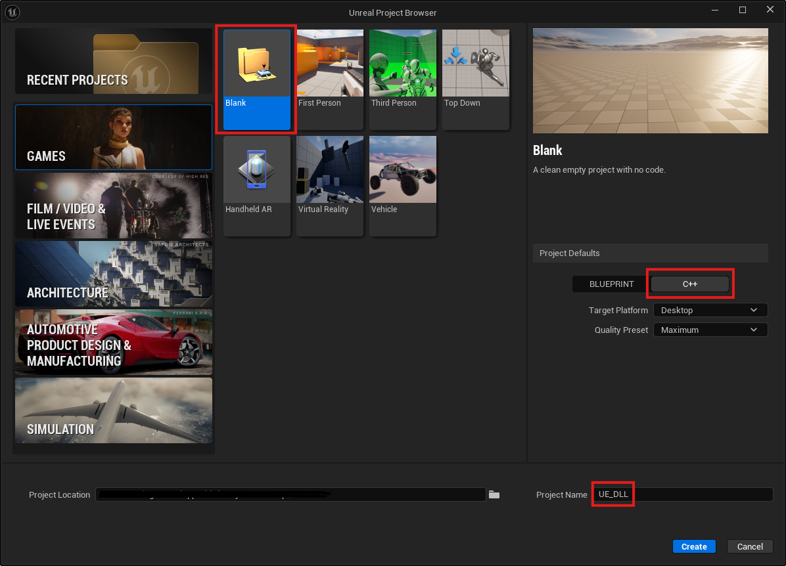
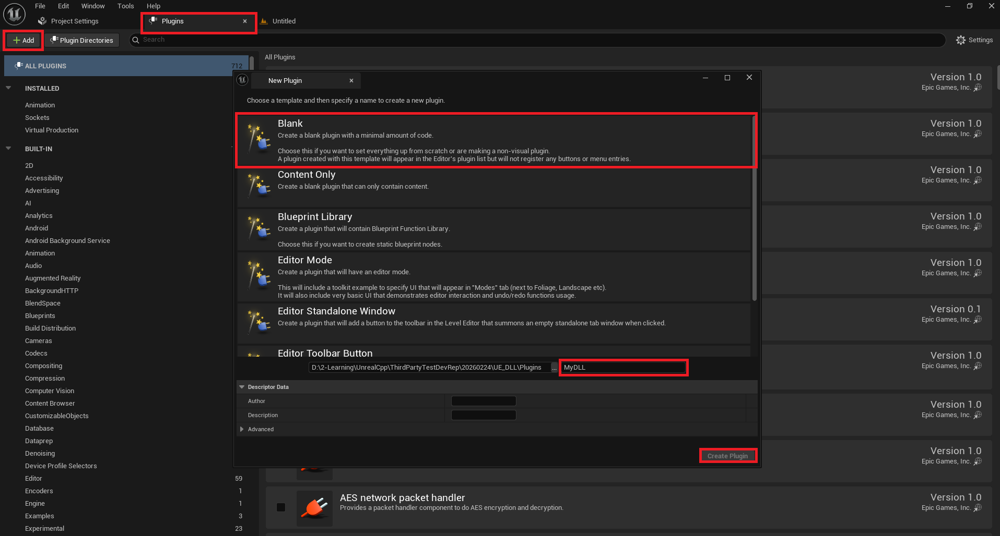
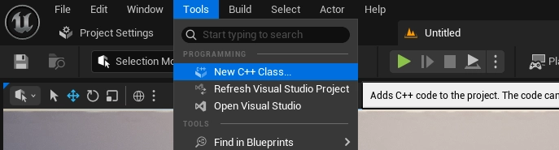
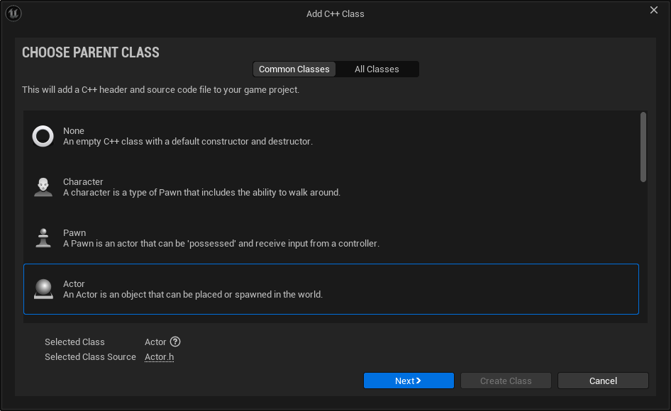
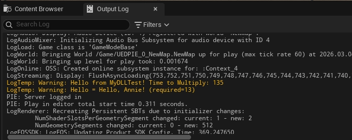

# 【Unreal & DLL 實戰系列】第五篇 —— Unreal Engine 專案與 Third Party Plugin 建置

建立好 DLL 之後，接著要整合到 Unreal Engine 中。

{/* truncate */}

首先，先建立一個新的 C++ 空專案。



接著，在 Plugin 頁面，點選左上角的 Add，點選 Blank，將插件取個名字，點選 Create Plugin 見裡插件。



接著，在 `UE 專案資料夾\Plugins\<插件名稱>\Source` 中建立 `ThirdParty` 資料夾，並按照下列資料夾結構將在 DLL 專案中製作的 `.dll` 與 `.lib` 檔，以及寫好的 Wrapper ( `ThirdPartyTestWrapper.cpp` 與 `ThirdPartyTestWrapper.h`  )複製過來，**不需要複製 ThirdPartyLibrary 的 .h 與 .cpp 檔。**

`Source/ThirdParty` 是 UE 專門給外部 Library 用的，UE 編譯器（UBT）會把 `Source/ThirdParty` 視為「外部依賴區」，不會把裡面的 `.cpp` 當成 UE 模組的一部分，因此：

- `.lib` 放這裡 → 編譯時連結
- `.dll` 放這裡 → 只是存放，不會被打包
- Wrapper `.cpp` 放這裡 → 會被編譯成 Plugin 的一部分
- `include` 資料夾是 UE 搜尋 Header 的地方

```powershell
Source
├─MyDLL
│  │  MyDLL.Build.cs //建立插件時自動建立
│  │
│  ├─Private
│  │      MyDLL.cpp //建立插件時自動建立
│  │
│  └─Public
│          MyDLL.h //建立插件時自動建立
│
└─ThirdParty //請自己新建資料夾(命名要為"ThirdParty")
│  ThirdPartyTestWrapper.cpp //從 DLL 專案中複製過來
│  ThirdPartyTest_DLL.dll //從 DLL 專案中複製過來
│  ThirdPartyTest_DLL.lib //從 DLL 專案中複製過來
│
└─include //請自己新建資料夾
  ThirdPartyTestWrapper.h //從 DLL 專案中複製過來
```

接著，將 ThirdPartyTest_DLL.dll 複製到 `UE 專案資料夾\Plugins\<插件名稱>\Binaries\Win64` 中，這樣才能在執行時被載入。

到這了我們所需的檔案皆以複製完成，下一步要在  `<插件名稱>.Build.cs` ，以我的情況為：MyDLL.Build.cs 中加入以下程式，將所需的資源加入編譯：

- **PublicSystemIncludePaths**：告訴編譯器「我的第三方函式庫的 .h 檔在這裡」。
- **PublicAdditionalLibraries**：告訴 linker「編譯時請連結這個 .lib」。
- **PublicDelayLoadDLLs**：告訴 UE「這個 DLL 執行時再載入，不要一開始就載」。
- **RuntimeDependencies**：告訴打包系統「打包時記得把這個 DLL 一起複製進去」。

整體就是：**編譯時用 .h + .lib，執行時載入 .dll，打包時把 .dll 帶進去。**

```
PublicSystemIncludePaths.Add("$(PluginDir)/Source/ThirdParty/include");

PublicAdditionalLibraries.Add("$(PluginDir)/Source/ThirdParty/ThirdPartyTest_DLL.lib");

PublicDelayLoadDLLs.Add("ThirdPartyTest_DLL.dll");

RuntimeDependencies.Add("$(PluginDir)/Binaries/Win64/ThirdPartyTest_DLL.dll");
```


接著，就可以進行編譯了，在方案總管 → 專案名稱 → 右鍵 → 重建(記得要把 Unreal Editor 關掉再編譯)。


建置成功後會顯示成功：


這樣基本的 Library 已經放進專案中了，接下來要在 Unreal 中使用他。

接著將 Unreal Engine Project 開啟，新建一個 C++ Class，選擇 Actor，取個名字，我這裡取 `MyDLLTest`，並選擇放置至插件資料夾中。






在 Visual Studio 中，剛剛建立的 C++ Class 會有 `.h` 與 `.cpp` 檔， `MyDLLTest.cpp`，將下列程式碼放進 BeginPlay() 中：

```powershell
FString DllPath = FPaths::Combine(FPaths::ProjectPluginsDir(), TEXT("MyDLL/Binaries/Win64/ThirdPartyTest_DLL.dll"));

void* ThirdPartyHandle = FPlatformProcess::GetDllHandle(*DllPath);

if (!ThirdPartyHandle)
{
    UE_LOG(LogTemp, Error, TEXT("Failed to load DLL"));
    return;
}

void* Obj = TPT_CreateProcessor();

if (!Obj)
{
    UE_LOG(LogTemp, Error, TEXT("Failed to Create Processor"));

    FPlatformProcess::FreeDllHandle(ThirdPartyHandle);

    return;
}

TPT_SetMultiplier(Obj, 3);

UE_LOG(LogTemp, Warning, TEXT("Hello from MyDLLTest! Time to Multiply: %d"), TPT_Multiply(Obj, 45));

TPT_DestroyProcessor(Obj);

char buffer[128];

int required = TPT_Hello(Obj, "Annie", buffer, sizeof(buffer));

UE_LOG(LogTemp, Warning, TEXT("Hello = %s (required=%d)"), UTF8_TO_TCHAR(buffer), required);

FPlatformProcess::FreeDllHandle(ThirdPartyHandle);
```

### 這段程式碼在做什麼？

1. 組合 DLL 路徑並載入 DLL
    
    ```powershell
    FString DllPath = FPaths::Combine(
        FPaths::ProjectPluginsDir(),
        TEXT("MyDLL/Binaries/Win64/ThirdPartyTest_DLL.dll")
    );
    
    void* ThirdPartyHandle = FPlatformProcess::GetDllHandle(*DllPath);
    
    if (!ThirdPartyHandle)
    {
        UE_LOG(LogTemp, Error, TEXT("Failed to load DLL"));
        return;
    }
    ```
    
    - `FPaths::ProjectPluginsDir()` 取得目前專案的 Plugins 目錄。
    - `GetDllHandle()` 嘗試載入 DLL，成功時回傳一個 handle。
    - 若 DLL 不存在、路徑錯誤、或缺少相依項 → handle 會是 `nullptr`。
    
    這一步確保 DLL 已成功載入，才能呼叫裡面的函式。
    
2. 建立 DLL 內部物件
    
    ```powershell
    void* Obj = TPT_CreateProcessor();
    
    if (!Obj)
    {
        UE_LOG(LogTemp, Error, TEXT("Failed to Create Processor"));
        FPlatformProcess::FreeDllHandle(ThirdPartyHandle);
        return;
    }
    ```
    
    - `TPT_CreateProcessor()` 是 DLL 提供的「工廠函式」。
    - DLL 內部會 `new` 一個 Processor 類別並回傳 `void*`。
    - UE 不直接 new DLL 裡的類別，避免跨 DLL 記憶體管理問題。
    
    如果物件建立失敗，必須立即釋放 DLL。
    
3. 呼叫 DLL 功能
    
    ```powershell
    TPT_SetMultiplier(Obj, 3);
    
    UE_LOG(LogTemp, Warning, TEXT("Hello from MyDLLTest! Time to Multiply: %d"),
        TPT_Multiply(Obj, 45));
    ```
    
    - `TPT_SetMultiplier()` 設定 DLL 內部物件的 multiplier。
    - `TPT_Multiply()` 執行計算（例如 45 × 3）。
    - UE 透過 wrapper API 操作 DLL 內部物件，而不需要知道類別細節。
4. 呼叫字串輸出函式
    
    ```powershell
    char buffer[128];
    int required = TPT_Hello(Obj, "Annie", buffer, sizeof(buffer));
    
    UE_LOG(LogTemp, Warning, TEXT("Hello = %s (required=%d)"),
        UTF8_TO_TCHAR(buffer), required);
    ```
    
    - DLL 會把字串寫入 `buffer`。
    - `required` 表示完整輸出所需的 buffer 大小（用於動態配置）。
    - `UTF8_TO_TCHAR()` 將 UTF-8 轉成 UE 的 `TCHAR` 字串。
    
    這是 DLL 與 UE 交換字串的典型方式。
    
5. 清理物件與卸載 DLL
    
    ```powershell
    TPT_DestroyProcessor(Obj);
    FPlatformProcess::FreeDllHandle(ThirdPartyHandle);
    ```
    
    - `TPT_DestroyProcessor()` 由 DLL 自己 delete 物件，避免跨 DLL delete 崩潰。
    - `FreeDllHandle()` 卸載 DLL，避免檔案被鎖住或記憶體洩漏。
    
    這是 DLL 整合中最重要的清理步驟。
    

寫好程式後，編譯程式。

接著，把此 Class 放入場景中，並按 Play，在 Output log 上就會看到我們呼叫 DLL 中的功能所輸出的文字。



好啦，做到這裡，我們已經讓整個 Unreal Engine 專案具備完整的第三方 DLL 整合能力了。

現在的架構能在編譯階段透過 `.lib` 正確連結 DLL 的 API，在執行階段以 `GetDllHandle()` 動態載入 `.dll`，並透過 Wrapper 安全地建立與銷毀 DLL 內部物件，同時讓 UE C++ 程式能直接呼叫 DLL 的功能；而在打包階段，`RuntimeDependencies` 也會確保 DLL 自動被包含在最終的遊戲內容中。

這次的練習專案只是個起點。未來無論是整合更複雜的原生 SDK、串接影像處理、網路協定、硬體驅動，甚至跨平台部署，都能沿用同樣的架構，穩穩地把外部世界接進 Unreal 的生態系裡。

[Integrating Third-Party Libraries into Unreal Engine | Unreal Engine 5.7 Documentation | Epic Developer Community](https://dev.epicgames.com/documentation/en-us/unreal-engine/integrating-third-party-libraries-into-unreal-engine)