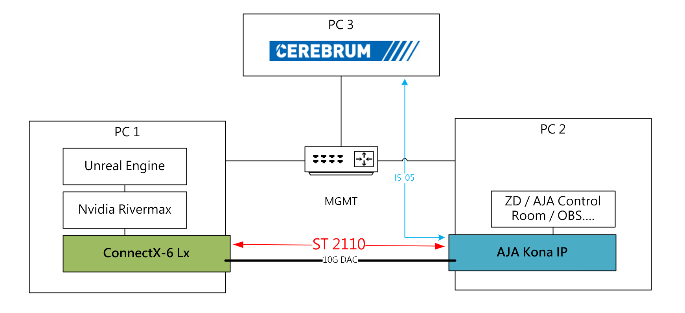

# 系統總覽

本系統以 NVIDIA Mellanox ConnectX‑6 系列網路介面卡 與 NVIDIA Rivermax SDK 為核心，建置一條符合 SMPTE ST 2110 的專業級 IP 視訊傳輸流程。Unreal Engine 負責即時渲染影像，並透過 Rivermax 將影像以 ST 2110‑20格式送出；接收端採用 AJA Kona IP 進行視訊解碼與監看。
整體訊號路由與來源切換則由 Cerebrum Broadcast Controller 透過 NMOS IS‑04 / IS‑05 進行統一管理與控制。

# 系統架構圖

本系統由三台主機構成，透過 10G 網路與管理交換器串聯，實現 ST 2110 視訊傳輸與 NMOS 控制整合：

## PC 1：Unreal Engine 渲染與 Rivermax 傳送端

- 安裝 Unreal Engine 與 NVIDIA Rivermax SDK
- 搭載 ConnectX‑6 Lx 網路卡，支援 ST 2110 訊號傳輸
- 透過 10G DAC 線直接連接至接收端（PC 2），傳送 ST 2110‑20 / 22 視訊流

| 元件 | 版本 |
| --- | --- |
| 作業系統 | Windows 10 Pro 22H2 |
| Unreal Engine | Unreal Engine 5.6.1 |
| NVIDIA Rivermax SDK | Rivermax_Windows_1.60.6 |
| ConnectX‑6 Lx 驅動 | 3.10.25798.0 |
| ConnectX‑6 Lx Firmware | 26.47.1026 |
| MFT（Mellanox Firmware Tools） | WinMFT_x64_4_34_1_10 |

:::tip[]

Connect-X 6 限制：此系列 NIC 雖受支援，但在 Windows 上無法提供完整 PTP 精準度。 [[i]](https://dev.epicgames.com/documentation/en-us/unreal-engine/setting-up-smpte-2110-in-unreal-engine#supported-network-cards)

:::

## PC 2：AJA Kona IP 接收端

- 搭載 AJA Kona IP 卡，支援 ST 2110 編解碼，接收/發送 ST 2110 流
- 所取得的 ST 2110 訊號可以供 ZD 工具、AJA Control Room、OBS 等軟體接收與監看
- 並可透過 NMOS 控制來源切換

| 元件 | 版本 |
| --- | --- |
| 作業系統 | Windows 11 Pro 25H2 |
| AJA Kona IP Driver | v17.0 |
| AJA Control Room | v17.0 |
| AJA Firmware | KonaIP s2110 - 2023/02/28 |

## PC 3：Cerevrum Broadcast Controller 控制端

- 執行 Cerevrum 控制軟體，並註冊至 NMOS Registry
- 透過 IS‑05 協定控制 Kona IP 的接收來源
- 連接至管理交換器（MGMT），與其他節點進行 NMOS 註冊與控制通訊

🔗 網路連線概述

- **10G DAC 直連：** PC 1 → PC 2，傳送 ST 2110 視訊流
- **MGMT 管理交換器：** 三台主機皆連接至此交換器，用於 NMOS 控制與管理通訊

    

## 資料來源
[Using SMPTE 2110 with nDisplay | Unreal Engine 5.7 Documentation | Epic Developer Community](https://dev.epicgames.com/documentation/en-us/unreal-engine/using-smpte-2110-with-ndisplay)

[SMPTE 2110 UX Reference in Unreal Engine | Unreal Engine 5.6 Documentation | Epic Developer Community](https://dev.epicgames.com/documentation/en-us/unreal-engine/smpte-2110-ux-reference-in-unreal-engine?application_version=5.6)

[SMPTE 2110 Media IO Workflows in Unreal Engine | Unreal Engine 5.6 Documentation | Epic Developer Community](https://dev.epicgames.com/documentation/en-us/unreal-engine/smpte-2110-media-io-workflows-in-unreal-engine?application_version=5.6)