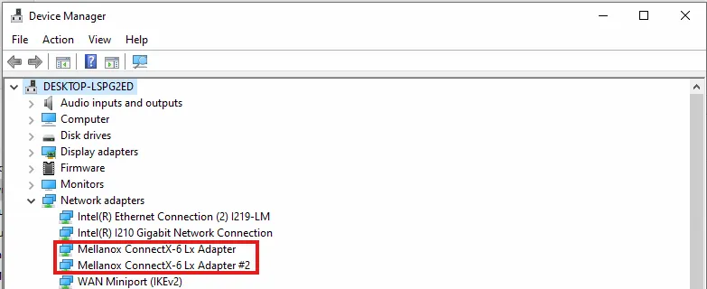
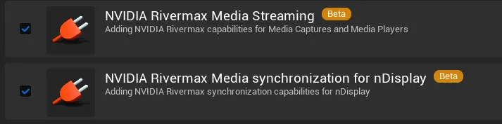

# 安裝與設定流程

## 安裝 ConnectX‑6 Lx 韌體更新

1. 至 [mlxup-mft 官方網站](https://network.nvidia.com/support/firmware/mlxup-mft/) ，選擇相對應的版本並下載韌體更新工具。
2. 至[ Nvidia firmware 官方網站](https://network.nvidia.com/support/firmware/firmware-downloads/)，下載所需要的韌體。
3. [**Updating Firmware Using a Specific Image**](https://docs.nvidia.com/networking/display/mlxupfwutility#src-49167189_mlxupFirmwareUtilityUserGuide-UpdatingFirmwareUsingaSpecificImage)
    
    In order to update the firmware of all NVIDIA adapter cards using a specific firmware image, run the following command:
    
    ```bash
    mlxup -i <file path>
    ```
    

## 安裝 ConnectX‑6 Lx Windows 驅動程式 [WibOF-2](https://docs.nvidia.com/nvidia-connectx-6-lx-pcie-hhhl-ethernet-adapter-cards-user-manual.pdf)

1. 至 [WibOF-2](https://network.nvidia.com/products/adapter-software/ethernet/windows/winof-2/) 頁面，這是 NVIDIA 官方的 Windows 驅動。
2. 選擇對應作業系統的驅動程式，並下載。
3. 執行並完成安裝，安裝完成後重開機。
4. 安裝成功後會在工作管理員看到此網卡。
    
    
    

## 安裝 Nvidia Rivermax

1. 進入 [Rivermax Getting Start Page](https://developer.nvidia.com/networking/rivermax-getting-started)  (需要登入並申請權限才能進入頁面)
2. 從下載區瀏覽各個版本的 Realease Note，尋找符合自己網卡的版本，本專案使用 Rivermax_Windows_1.60.6。
3. 跟著 Installation Guide 安裝，由於我們已經安裝完 WinOF-2 ，因此直接安裝 Rivermax。
4. 使用**系統管理員身分**開啟命令提示字元，去到 `Rivermax-<Version>-win64.msi` 所放置的資料夾，執行以下指令：
    
    ```jsx
    Rivermax-<Version>-win64.msi
    ```
    
5. 會跳出安裝頁面：
    
    
    
6. 跟著安裝指示安裝並將電腦重開機。

## [NVIDIA’s Rivermax SDK License](https://dev.epicgames.com/documentation/en-us/unreal-engine/setting-up-smpte-2110-in-unreal-engine#license)

請至[官方網站](https://developer.nvidia.com/rivermax-development-licence-request)申請 Rivermax 開發授權。
取得授權檔後，將其放置於 Rivermax DLL 所在目錄，系統預設會在該位置尋找授權檔。
若希望將授權檔放在其他位置（例如網路磁碟機），可使用環境變數：`RIVERMAX_LICENSE_PATH` 指定自訂的授權檔路徑。

## Unreal Rivermax 設定

開啟以下 Plugin 並重啟 Unreal Editor。




## **Troubleshooting SMPTE 2110**

### Rainbow-colored Video When Opening RivermaxMediaSource

若在開啟 **RivermaxMediaSource** 時看到「彩虹色（rainbow-colored）」影像，而這並非預期行為，請確認 ConnectX NIC 的 FLEX Parser 設定是否正確。

1. 安裝 `mlxconfig`（[Mellanox Firmware Tools, MFT](https://network.nvidia.com/products/adapter-software/firmware-tools/)) 。`mlxconfig` 是 Mellanox Firmware Tools（MFT）的一部分，用於查詢與設定 ConnectX NIC 的硬體參數。
2. 驗證 FLEX Parser 設定
    
    使用系統管理員身分執行以下指令，確認兩個參數的輸出是否一致：
    
    ```jsx
    mlxconfig.exe q | findstr "FLEX_PARSER_PROFILE_ENABLE PROG_PARSE_GRAPH"
    ```
    
    [請確保這兩個參數的輸出內容完全一致。](https://dev.epicgames.com/community/api/documentation/image/65a2f86a-54c9-45df-a99a-f1d73229b093?resizing_type=fit)
    
    若不一致，可能導致 NIC 無法正確解析 RTP Header，造成影像呈現彩虹色或錯位。
    
3. 如不一致，請使用系統管理員身分執行以下指令查詢裝置名稱：
    
    ```jsx
    mst status
    ```
    
    如果服務未啟動，請輸入：
    
    ```jsx
    mst start
    ```
    
    然後再輸入 `mst status` 會看到類似下列輸出：
    
    
    
    圖中 mt4127_pciconf0 位置的值即為你的裝置名稱。
    
4. 填入你的裝置名稱，輸入下列指令更改設定：
    
    ```jsx
    mlxconfig.exe -d <你的裝置名稱> set FLEX_PARSER_PROFILE_ENABLE=1
    mlxconfig.exe -d <你的裝置名稱> set PROG_PARSE_GRAPH=1
    mlxconfig.exe -d <你的裝置名稱> reset
    ```
    
    如：
    
    ```jsx
    mlxconfig.exe -d mt4127_pciconf0 set FLEX_PARSER_PROFILE_ENABLE=1
    mlxconfig.exe -d mt4127_pciconf0 set PROG_PARSE_GRAPH=1
    mlxconfig.exe -d mt4127_pciconf0 reset
    ```
    
5. 更改完後輸入以下指令確認輸出：
    
    ```jsx
    mlxconfig.exe q | findstr "FLEX_PARSER_PROFILE_ENABLE PROG_PARSE_GRAPH"
    ```